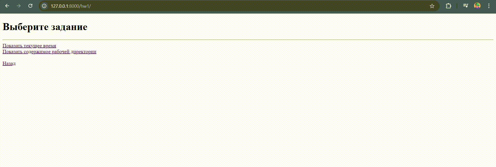
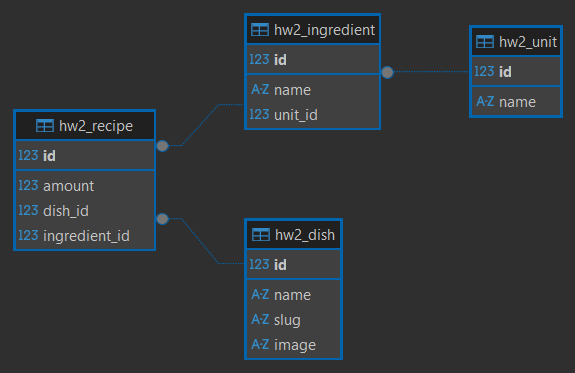
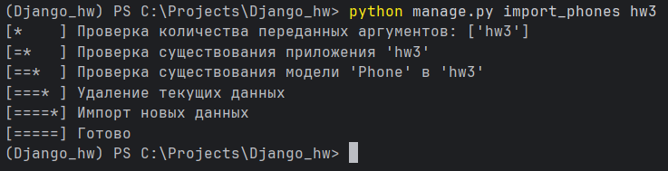
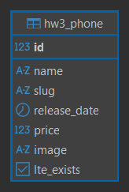
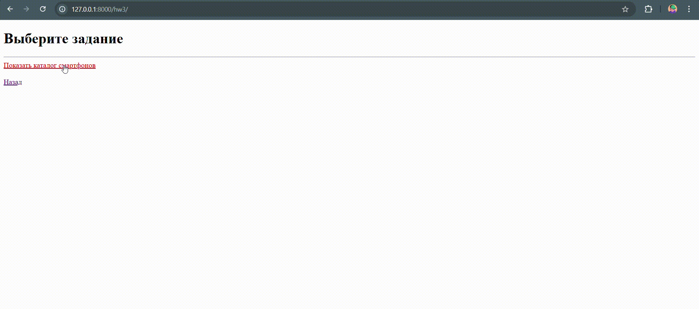
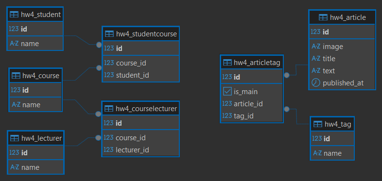
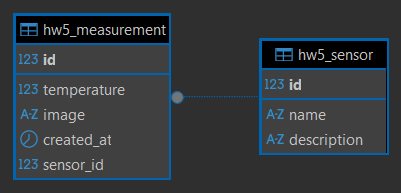
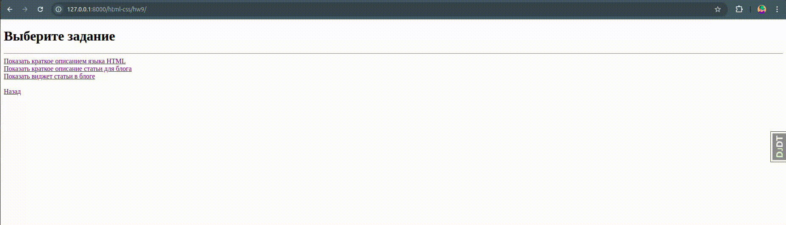

# Django: создание backend-приложений

- [Знакомство с Django. Подготовка и запуск проекта](#hw1-знакомство-с-django-подготовка-и-запуск-проекта)
- [Обработка запросов и шаблоны](#hw2-обработка-запросов-и-шаблоны)
- [Работа с ORM](#hw3-работа-с-orm)
- [Работа с ORM, 2 часть](#hw4-работа-с-orm-2-часть)
- [Знакомство с API на примере Django REST framework](#hw5-знакомство-с-api-на-примере-django-rest-framework)
- [CRUD в DRF](#hw6-crud-в-drf)
- [Разделение доступа в DRF](#hw7-разделение-доступа-в-drf)

# HTML и CSS: основы веб-верстки

- [Введение в верстку](#hw9-введение-в-верстку)

## HW1: Знакомство с Django. Подготовка и запуск проекта

#### Функционал:

- Общие настройки проекта `settings.py`
- Базовые классы представлений и шаблоны для наследования
- Меню с навигацией для просмотра выполненных заданий
- Отображение текущего времени и содержимого рабочей директории проекта

#### Маршрутизация:

| URL                  | 
|----------------------|
| `/hw1/`              |
| `/hw1/current_time/` |
| `/hw1/workdir/`      | 

#### Визуализация:



## HW2: Обработка запросов и шаблоны

#### Функционал:

- Inline-форма в панеле админстратора для взаимодействия c БД
- Список кулинарных рецептов с пагинацией `?page=`
- Детальная страница каждого рецепта с ингредиентами 
- Пересчет количества ингредиентов через параметр порций `?servings=`
- Навигация с возможностью вернуться на последнюю просмотренную страницу

#### Загрузка тестовых данных:

```
python manage.py resetapptables hw2
python manage.py loaddata apps/fspy/hw2/recipes.json
```

#### Схема БД:



#### Маршрутизация:

| URL                                  | 
|--------------------------------------|
| `/admin/hw2/`                        |
| `/hw2/`                              |
| `/hw2/recipes/?page=`                |
| `/hw2/recipes/<recipe>/?servings=`   | 

#### Визуализация:


## HW3: Работа с ORM

#### Функционал:

- Кастомная команда управления для взаимодействия c БД
- Каталог смартфонов с сортировкой по параметру `?sort=`
- Детальная страница каждого смартфона
- Навигация с возможностью вернуться на последнюю просмотренную страницу

#### Загрузка тестовых данных:

```
python manage.py resetapptables hw3
python manage.py import_phones hw3
```



#### Схема БД:



#### Маршрутизация:

| URL                      | 
|--------------------------|
| `/hw3/`                  |
| `/hw3/catalog/?sort=`    |
| `/hw3/catalog/<phone>/`  | 

#### Визуализация:



## HW4: Работа с ORM, 2 часть

#### Функционал:

- Список инфоцыганских курсов с возможностью случайной генерации данных
- Список новостных статей с главным и второстепенными тэгами
- Inline-форма с валидацией выбора основного тэга новостной статьи
- Навигация с возможностью вернуться на последнюю просмотренную страницу

#### Загрузка тестовых данных:

```
python manage.py resetapptables hw4
python manage.py loaddata apps/fspy/hw4/articles.json
```

#### Схема БД:



#### Маршрутизация:

| URL               | 
|-------------------|
| `/admin/hw4/`     |
| `/hw4/`           |
| `/hw4/courses/`   | 
| `/hw4/articles/`  |

#### Визуализация:


## HW5: Знакомство с API на примере Django REST framework

#### Функционал:

- REST API для управления датчиками температуры и их измерениями
- Создание, просмотр и изменение датчиков через API
- Добавление измерений температуры с возможностью прикрепления изображений
- Просмотр списка датчиков с краткой информацией и детальной информации по каждому датчику
- Навигация с возможностью вернуться в меню из интерфейса API

#### Загрузка тестовых данных:

```
python manage.py resetapptables hw5
python manage.py loaddata apps/fspy/hw5/sensors.json
```

#### Схема БД:



#### Маршрутизация:

| Метод     | URL                      | 
|-----------|--------------------------|
|           | `/hw5/`                  |
| POST      | `/hw5/api/measurements/` |
| GET, POST | `/hw5/api/sensors/ `     |
| GET, PUT  | `/hw5/api/sensor/<pk>/ ` |

#### Визуализация:


## HW9: Введение в верстку

#### Маршрутизация:

| URL                             | 
|---------------------------------|
| `/html-css/hw9/`                |
| `/html-css/hw9/html-info/`      | 
| `/html-css/hw9/blog-preview/`   |
| `/html-css/hw9/article-widget/` |

#### Визуализация:

